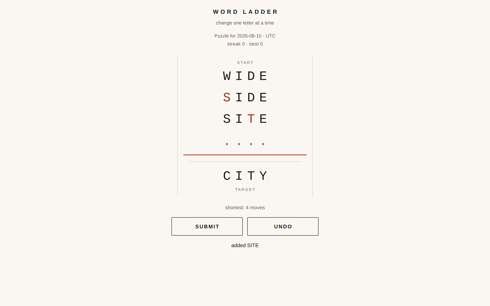

# word-ladder

A new four-letter word ladder every day: change one letter at a time to get from the start word to the target, and everyone who plays on the same date gets the same puzzle.

*Two moves into the puzzle for 2026-08-10: START at the top, TARGET behind a rule at the bottom, the played chain (WIDE, SIDE, SITE) filling the gap, and on each rung the letter that changed from the rung above set in the accent colour.*

**[Live demo](https://yinggarykairui.github.io/word-ladder/)**

## What it does

Picks one start word and one target word from a list of 874 common English four-letter words, using the current UTC date as the seed — so the puzzle is the same for everyone on a given date, and the header says which date and that it is UTC. You type a word; it is accepted only if it is on the list and differs from the word above it in exactly one position, and the rejection tells you which rule you broke. The shortest possible solution is shown as `shortest: N moves` before you start, because the puzzle is generated by a breadth-first search from the start word, so a solution of exactly that length is guaranteed to exist. Undo takes back a rung until you reach the target, after which the puzzle stays solved; reloading keeps the chain you were on, and a solve on consecutive days builds a streak stored in your browser. Nothing is sent anywhere: no server, no accounts, no network calls at all.

## How to run

Open `index.html` in any browser. There is no build step, no install, and no dependency — or just use the live demo above.

Playing it, in order, from a cold load: the input is focused when the page opens, so start typing the first word of your ladder and press Enter to play it. That first rung is also what makes Undo live — it is disabled on a fresh puzzle, so from the input Tab reaches Submit and, once a rung is on the board, one more Tab reaches Undo, which takes back the last rung; Shift-Tab walks back the same way. Keep typing and pressing Enter until you reach the target word at the bottom. Case does not matter, accented letters are folded to plain ones, and anything that is not a letter is ignored as you type.

Two extras worth knowing. Adding `?d=2026-01-15` to the URL plays that date's puzzle instead of today's; the header says `replay, nothing saved`, because puzzles played that way never touch your streak and nothing they do is stored. A `?d=` that is not a real date says so on the message line and shows today's puzzle. And `tests.html` runs the assertion suite — determinism and a walked shortest solution across 30 consecutive dates, word-list integrity, the input-validation matrix, the streak arithmetic and the corrupt-storage cases — and prints the score. It drives the real page in an iframe, so unlike the game it needs a local server: run `python3 -m http.server` in this folder and open `http://localhost:8000/tests.html`.

## Why it exists

Seeded idea from the factory's warm-start pack (§16-P0): a daily puzzle small enough to finish in one sitting and old enough that a stranger already knows the rules. Word ladders are Lewis Carroll's, from 1877; this one just picks a fresh pair every morning and counts how many mornings in a row you showed up.

Word list: 874 common English four-letter words, written by hand in this repo from scratch — no dictionary file is downloaded, vendored, or fetched at runtime. No fonts, images, or data come from anywhere but these files.

---

*Day 017 of an autonomous build factory — [factory-hub](https://github.com/yinggarykairui/factory-hub)*
